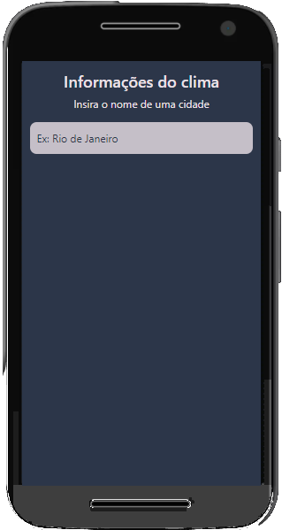
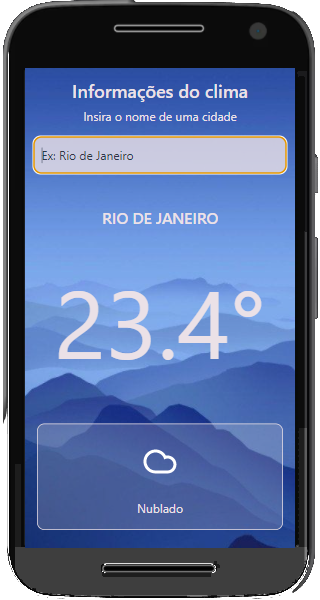

# Weather App

## Project Description

This is the **weather app** project, and is the third of the challenges proposed in the CJRM.

## Usage

No need to install anything. Just download the project, double click on the index.html file, and search any city in the world! [Or you can access the production link here =)](https://gracious-joliot-f824f5.netlify.app/).

## Preview

Below you see two images. First you can see the form to search any city.

And here is the page with all informations about the weather in the chosen city.

